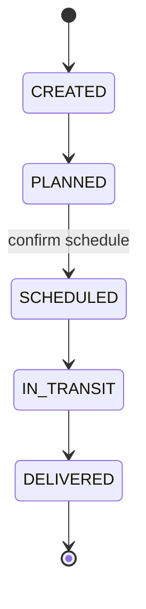

# OVGS — Sales Order Management System

A frontend application for managing the full lifecycle of **Sales Orders** (Ordens de Venda):
registries, order creation, an operational state machine, delivery scheduling, operational
monitoring and an audit trail.

The backend is fully **mocked with Mock Service Worker (MSW)**, so the app runs end-to-end without
any external service while keeping a realistic REST boundary that could be swapped for a real API
by changing a single configuration value.

> Written entirely in English (code, folders and identifiers), as required by the challenge.

---

## Table of contents

- [Tech stack](#tech-stack)
- [Getting started](#getting-started)
- [Available scripts](#available-scripts)
- [Running with Docker](#running-with-docker)
- [Project structure](#project-structure)
- [Feature overview](#feature-overview)
- [Domain modeling strategy](#domain-modeling-strategy)
- [Business rules](#business-rules)
- [Order lifecycle (state machine)](#order-lifecycle-state-machine)
- [Architecture decisions](#architecture-decisions)
- [Persistence strategy](#persistence-strategy)
- [Testing strategy](#testing-strategy)
- [Scalability considerations](#scalability-considerations)
- [Performance considerations](#performance-considerations)
- [Trade-offs](#trade-offs)

---

## Tech stack

| Concern             | Choice                                                 |
| ------------------- | ------------------------------------------------------ |
| UI library          | **React 19**                                           |
| Build tool          | **Vite**                                               |
| Language            | **TypeScript** (strict)                                |
| Routing             | **TanStack Router** (type-safe, code-based route tree) |
| Server state        | **TanStack Query (React Query)**                       |
| Client/global state | **Redux Toolkit**                                      |
| Side effects        | **Redux Saga** (audit trail + global effects)          |
| Styling             | **Tailwind CSS v4**                                    |
| Forms               | **React Hook Form**                                    |
| Validation          | **Zod**                                                |
| HTTP client         | **Axios**                                              |
| Mocked API          | **MSW (Mock Service Worker)**                          |
| Icons               | lucide-react                                           |
| Dates               | date-fns                                               |
| Testing             | **Vitest** + **React Testing Library** + MSW           |
| Quality             | ESLint, Prettier, Husky, lint-staged                   |
| Delivery            | Docker (multi-stage build) + Docker Compose + nginx    |

---

## Getting started

**Requirements:** Node.js 20+ (developed on Node 22 — see `.nvmrc`) and npm 10+.

```bash
# use the pinned Node version
nvm use

# install dependencies
npm install

# start the dev server → http://localhost:5173
npm run dev
```

The mocked API starts automatically in development; no additional setup is required. Seed data
(customers, transport types, items and a few orders) is available on first load.

## Available scripts

| Script                  | Description                             |
| ----------------------- | --------------------------------------- |
| `npm run dev`           | Start the Vite dev server               |
| `npm run build`         | Type-check and build for production     |
| `npm run preview`       | Preview the production build            |
| `npm run lint`          | Run ESLint                              |
| `npm run format`        | Format with Prettier                    |
| `npm run typecheck`     | Type-check the whole project (`tsc -b`) |
| `npm run test`          | Run the test suite once                 |
| `npm run test:watch`    | Run tests in watch mode                 |
| `npm run test:coverage` | Run tests with a coverage report        |

## Running with Docker

The production image builds the static bundle and serves it with nginx (SPA fallback + gzip +
long-term asset caching).

```bash
docker compose up --build
# app served at http://localhost:8080
```

## Project structure

The codebase follows a **feature-based architecture** with a clear dependency direction:
`features` and `app` depend on `shared`; `shared` depends on nothing app-specific.

```
src/
├── app/                    # Application shell
│   ├── config/             # Typed runtime configuration (API base URL, mocks flag)
│   ├── layouts/            # Root layout (sidebar + header)
│   ├── providers/          # Redux + Query + Router providers
│   ├── router/             # Code-based route tree and navigation config
│   └── store/              # Redux store, root reducer, root saga, typed hooks
│
├── shared/                 # Cross-cutting building blocks
│   ├── api/                # Axios client, Query client, query keys
│   ├── components/         # UI kit (Button, Modal, DataTable, ...) + page primitives
│   ├── lib/                # cn(), error helpers
│   ├── types/              # Domain entity types (single source of vocabulary)
│   └── utils/              # Formatters (currency, dates, document)
│
├── features/               # Self-contained feature modules
│   ├── dashboard/          # Operational overview
│   ├── customers/          # Customer registry (CRUD)
│   ├── transport-types/    # Transport type registry (CRUD)
│   ├── items/              # Item catalog (create + search)
│   ├── sales-orders/       # Orders: domain logic, api, queries, screens
│   │   └── domain/         # Pure logic: state machine, rules, status/schedule labels
│   ├── scheduling/         # Scheduling center
│   ├── monitoring/         # Filtered operational monitoring
│   └── audit/              # Audit trail (saga + screen)
│
├── mocks/                  # MSW: in-memory database, seed and request handlers
└── tests/                  # Test setup and render helpers
```

Each feature typically exposes: `api.ts` (HTTP calls), `queries.ts` (React Query hooks),
`schema.ts` (Zod), `domain/` (pure logic) and `components/` (screens).

## Feature overview

- **Sales Orders** — create, list, detail; advance status through the lifecycle; change transport.
- **Scheduling Center** — set delivery date + service window, confirm, and reschedule.
- **Monitoring** — filter orders by status, customer, transport type and creation date range.
- **Dashboard** — per-status metrics and recent orders.
- **Registries** — customers (with authorized transport types), transport types, items.
- **Audit Trail** — chronological record of order creation, status, schedule and transport changes.

## Domain modeling strategy

Entities live in `shared/types` as the shared vocabulary, while behavior lives close to the feature
that owns it (`features/sales-orders/domain`).

- **Customer** — owns `authorizedTransportTypeIds`, the anchor for the transport authorization rule.
- **TransportType** — modeled as **data, not an enum**, so new modalities are added through the
  registry without any code change (explicit requirement).
- **Item** — catalog entry with a unique **SKU**; assumed to pre-exist and be referenced by orders.
- **SalesOrder** — belongs to exactly one customer and one transport type, contains **line items
  that snapshot** SKU/name/price at creation time (so later catalog edits never rewrite history),
  a lifecycle `status` and an optional embedded `Schedule`.
- **AuditEvent** — immutable record with timestamp, action, entity, and previous/next state.

The **status flow is English in code** (`CREATED`, `PLANNED`, `SCHEDULED`, `IN_TRANSIT`,
`DELIVERED`) and mapped to display labels in the UI layer, decoupling domain values from
presentation.

## Business rules

- An order can only be created with a transport type **authorized for the selected customer**.
- An order must belong to **one customer**, have **exactly one transport type** and **at least one
  item**.
- Only **valid, forward-only** status transitions are allowed; anything else is rejected (HTTP 422).
- Reaching `SCHEDULED` requires a **confirmed schedule** (enforced by the scheduling flow).
- Transport can only be changed **before dispatch** (`IN_TRANSIT`/`DELIVERED` lock it).

Rules are implemented as **pure functions** and enforced in two places: on the client for immediate
UX feedback, and in the mocked API as the authoritative boundary (as a real backend would).

## Order lifecycle (state machine)



The transition table is data-driven (`ALLOWED_TRANSITIONS`), so evolving the flow (e.g. adding a
cancellation branch) is a data change, not a rewrite of consuming code.

## Architecture decisions

- **Server state vs. client state are separated.** React Query owns everything that comes from the
  API (orders, registries, audit) with caching and invalidation. Redux Toolkit owns purely
  client-side global state (notifications) and orchestrates cross-cutting side effects.
- **Redux Saga is scoped to the audit trail and global effects.** Feature mutations simply dispatch
  a `recordAuditEvent` action after a successful change; a saga listens, persists the event and
  invalidates the audit cache. This keeps audit logging a true cross-cutting concern, fully
  decoupled from feature code, and demonstrates a clear, justified use of Saga instead of adding it
  everywhere.
- **Domain logic is pure and framework-agnostic** (`sales-orders/domain`), which makes the core
  rules trivially unit-testable and reusable by both UI and the mocked API.
- **The API boundary is real even though it is mocked.** Axios + a normalized `ApiError` + typed
  service functions mean swapping MSW for a real backend only touches `app/config/env.ts`.
- **Type-safe, code-based routing** keeps navigation and params fully typed without a build step.
- **Feature-based structure** localizes change: a feature owns its api, hooks, schema, domain and
  UI, while `shared` holds only genuinely reusable pieces.

## Persistence strategy

Persistence is simulated by an **in-memory database** (`src/mocks/db.ts`) behind a RESTful MSW
layer. The handlers enforce invariants (uniqueness, authorization, valid transitions) and return
proper status codes (`201`, `404`, `422`), so the client integrates against realistic semantics.

Because the store is in-memory, **data resets on a full page reload** — an intentional trade-off for
a mock backend. The persistence seam is deliberately thin: replacing MSW with a real API requires
only pointing `VITE_API_BASE_URL` at the backend and disabling mocks (`VITE_ENABLE_MOCKS=false`);
no feature or component code changes.

## Testing strategy

Run with `npm run test`. The suite covers three layers:

1. **Unit** — the sales order **state machine** and **business rules** (pure functions).
2. **API integration** — the mocked backend exercised through the real service layer: order
   creation, transport authorization rejection, the full lifecycle, and invalid transitions.
3. **Component integration** — the customers screen rendered with Redux + React Query + MSW:
   listing seed data, creating a record through the form, and client-side validation.

MSW is shared between the app and tests, so tests run against the exact same request handlers the
app uses. The in-memory database is reset before each test for isolation.

## Scalability considerations

- **Feature isolation** keeps the codebase navigable as it grows; features can later be code-split
  per route (the router already supports lazy routes) with minimal change.
- **Normalized query keys** (`shared/api/queryKeys.ts`) make cache invalidation predictable and
  scalable across features.
- **List endpoints already accept server-side filters**; they are ready to be extended with
  pagination/cursor support when data volume grows, without changing the UI contract.
- **Data-driven transport types and a data-driven state machine** allow the business to evolve
  (new modalities, new states) without code changes rippling through the app.

## Performance considerations

- **React Query caching** with a sensible `staleTime` avoids redundant network round-trips and
  refetch storms; mutations invalidate only the affected keys.
- **Snapshotting line items** on orders removes the need to join/enrich against the catalog on every
  read.
- **Route-level intent preloading** (`defaultPreload: 'intent'`) warms data on hover.
- **Derived data is memoized** (lookup maps, totals) to keep re-renders cheap.
- The production build is split (vendor/app) and served **gzipped with immutable caching** for
  hashed assets via nginx.

## Trade-offs

- **Mocked, in-memory persistence** was chosen over a real database to keep the challenge focused on
  frontend architecture. The cost is no cross-reload persistence; the benefit is a realistic,
  self-contained, easily runnable app with a clean swap path to a real backend.
- **Client-side audit via Saga** matches the requested architecture and cleanly decouples audit from
  features. In a production system, audit would typically be recorded server-side for
  tamper-resistance; the trade-off is documented and the client approach is intentional here.
- **Business rules enforced on both client and mock API** introduces light duplication, but the
  rules are shared pure functions and the redundancy mirrors a real system (UX validation + backend
  authority).
- **Redux Saga is intentionally minimal.** Rather than routing all async through Saga, it is scoped
  to audit/global effects while React Query handles data fetching — the right tool for each job.
- **A small custom UI kit** was built instead of adopting a component library, to keep the bundle
  lean and the styling consistent; the trade-off is fewer out-of-the-box components.

---

## License

Technical challenge — not licensed for production use.
