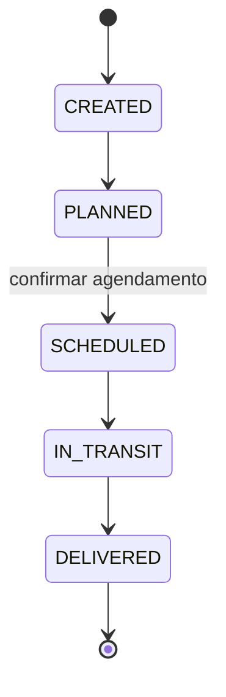

# Arquitetura

Documentação das decisões de modelagem, regras de negócio, ciclo de vida das ordens,
arquitetura da aplicação, persistência, testes, escalabilidade, performance e trade-offs.

## Estratégia de modelagem de domínio

As entidades vivem em `shared/types` como o vocabulário compartilhado, enquanto o comportamento fica
próximo da funcionalidade que o detém (`features/sales-orders/domain`).

- **Customer** — detém `authorizedTransportTypeIds`, âncora da regra de autorização de transporte.
- **TransportType** — modelado como **dado, não como enum**, para que novas modalidades sejam
  adicionadas pelo cadastro sem qualquer alteração de código (requisito explícito).
- **Item** — entrada de catálogo com um **SKU** único; assume-se que já exista e seja referenciado por ordens.
- **SalesOrder** — pertence a exatamente um cliente e um tipo de transporte, contém **linhas de item
  que fazem um snapshot** de SKU/nome/preço no momento da criação (para que edições posteriores no
  catálogo nunca reescrevam o histórico), um `status` de ciclo de vida e um `Schedule` opcional embutido.
- **AuditEvent** — registro imutável com timestamp, ação, entidade e estado anterior/próximo.

O **fluxo de status é em inglês no código** (`CREATED`, `PLANNED`, `SCHEDULED`, `IN_TRANSIT`,
`DELIVERED`) e mapeado para rótulos de exibição na camada de UI, desacoplando os valores de domínio
da apresentação.

## Regras de negócio

- Uma ordem só pode ser criada com um tipo de transporte **autorizado para o cliente selecionado**.
- Uma ordem deve pertencer a **um cliente**, ter **exatamente um tipo de transporte** e **pelo menos um
  item**.
- Apenas transições de status **válidas e somente para frente** são permitidas; qualquer outra é rejeitada (HTTP 422).
- Atingir `SCHEDULED` requer um **agendamento confirmado** (imposto pelo fluxo de agendamento).
- O transporte só pode ser alterado **antes do despacho** (`IN_TRANSIT`/`DELIVERED` o bloqueiam).

As regras são implementadas como **funções puras** e impostas em dois lugares: no cliente, para
feedback imediato de UX, e na API simulada, como a fronteira autoritativa (como faria um backend real).

## Ciclo de vida da ordem (máquina de estados)

A tabela de transições é orientada a dados (`ALLOWED_TRANSITIONS`), de modo que evoluir o fluxo (por
exemplo, adicionar um ramo de cancelamento) é uma mudança de dados, não uma reescrita do código consumidor.

## Decisões de arquitetura

- **Estado de servidor e estado de cliente são separados.** O React Query detém tudo o que vem da
  API (ordens, cadastros, auditoria) com cache e invalidação. O Redux Toolkit detém o estado global
  puramente do cliente (notificações) e orquestra efeitos colaterais transversais.
- **O Redux Saga é escopado à trilha de auditoria e a efeitos globais.** As mutações de funcionalidade
  simplesmente disparam uma ação `recordAuditEvent` após uma alteração bem-sucedida; uma saga escuta,
  persiste o evento e invalida o cache de auditoria. Isso mantém o log de auditoria como uma verdadeira
  preocupação transversal, totalmente desacoplada do código das funcionalidades, e demonstra um uso
  claro e justificado do Saga em vez de aplicá-lo em todo lugar.
- **A lógica de domínio é pura e agnóstica de framework** (`sales-orders/domain`), o que torna as
  regras centrais trivialmente testáveis por unidade e reutilizáveis tanto pela UI quanto pela API simulada.
- **A fronteira da API é real, mesmo sendo simulada.** Axios + um `ApiError` normalizado + funções de
  serviço tipadas fazem com que trocar o MSW por um backend real toque apenas em `app/config/env.ts`.
- **Roteamento type-safe baseado em código** mantém navegação e parâmetros totalmente tipados sem uma etapa de build.
- **A estrutura baseada em funcionalidades** localiza a mudança: uma funcionalidade detém sua api,
  hooks, schema, domínio e UI, enquanto `shared` guarda apenas as peças genuinamente reutilizáveis.

## Estratégia de persistência

A persistência é simulada por um **banco de dados em memória** (`src/mocks/db.ts`) por trás de uma
camada RESTful com MSW. Os handlers impõem invariantes (unicidade, autorização, transições válidas) e
retornam códigos de status apropriados (`201`, `404`, `422`), de modo que o cliente integra com
semânticas realistas.

Por ser em memória, **os dados são reiniciados a cada recarga completa da página** — um trade-off
intencional para um backend simulado. A costura de persistência é deliberadamente fina: substituir o
MSW por uma API real exige apenas apontar `VITE_API_BASE_URL` para o backend e desabilitar os mocks
(`VITE_ENABLE_MOCKS=false`); nenhuma alteração no código de funcionalidades ou componentes.

## Estratégia de testes

Execute com `npm run test`. A suíte cobre três camadas:

1. **Unidade** — a **máquina de estados** e as **regras de negócio** das ordens de venda (funções puras).
2. **Integração de API** — o backend simulado exercitado pela camada de serviço real: criação de
   ordem, rejeição por autorização de transporte, o ciclo de vida completo e transições inválidas.
3. **Integração de componente** — a tela de clientes renderizada com Redux + React Query + MSW:
   listagem dos dados iniciais, criação de um registro pelo formulário e validação no cliente.

O MSW é compartilhado entre a aplicação e os testes, de modo que os testes rodam contra exatamente os
mesmos handlers de requisição que a aplicação usa. O banco em memória é reiniciado antes de cada teste
para garantir isolamento.

## Considerações de escalabilidade

- **O isolamento por funcionalidade** mantém o código navegável conforme ele cresce; as funcionalidades
  podem depois ser divididas em chunks por rota (o router já suporta rotas lazy) com mudança mínima.
- **Query keys normalizadas** (`shared/api/queryKeys.ts`) tornam a invalidação de cache previsível e
  escalável entre funcionalidades.
- **Os endpoints de listagem já aceitam filtros no servidor**; estão prontos para serem estendidos com
  suporte a paginação/cursor conforme o volume de dados cresce, sem mudar o contrato da UI.
- **Tipos de transporte orientados a dados e uma máquina de estados orientada a dados** permitem que o
  negócio evolua (novas modalidades, novos estados) sem que alterações de código se propaguem pela aplicação.

## Considerações de performance

- **O cache do React Query** com um `staleTime` sensato evita idas e vindas de rede redundantes e
  tempestades de refetch; as mutações invalidam apenas as chaves afetadas.
- **O snapshot das linhas de item** nas ordens elimina a necessidade de fazer join/enriquecimento com o
  catálogo a cada leitura.
- **Preload por intenção no nível de rota** (`defaultPreload: 'intent'`) aquece os dados no hover.
- **Os dados derivados são memoizados** (mapas de lookup, totais) para manter as re-renderizações baratas.
- O build de produção é dividido (vendor/app) e servido **com gzip e cache imutável** para os assets
  com hash, via nginx.

## Trade-offs

- **Persistência simulada em memória** foi escolhida em vez de um banco real para manter o desafio
  focado na arquitetura frontend. O custo é a ausência de persistência entre recargas; o benefício é
  uma aplicação realista, autocontida e facilmente executável, com um caminho limpo de troca para um backend real.
- **Auditoria no cliente via Saga** corresponde à arquitetura solicitada e desacopla a auditoria das
  funcionalidades de forma limpa. Em um sistema de produção, a auditoria normalmente seria registrada no
  servidor para resistência a adulteração; o trade-off está documentado e a abordagem no cliente é intencional aqui.
- **Regras de negócio impostas tanto no cliente quanto na API simulada** introduzem uma leve duplicação,
  mas as regras são funções puras compartilhadas e a redundância espelha um sistema real (validação de
  UX + autoridade do backend).
- **O Redux Saga é intencionalmente mínimo.** Em vez de rotear todo o assíncrono pelo Saga, ele é
  escopado a auditoria/efeitos globais, enquanto o React Query cuida da busca de dados — a ferramenta
  certa para cada tarefa.
- **Um pequeno UI kit customizado** foi construído em vez de adotar uma biblioteca de componentes, para
  manter o bundle enxuto e a estilização consistente; o trade-off é ter menos componentes prontos.
